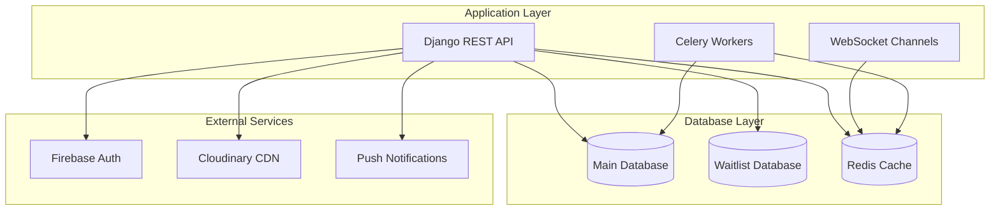
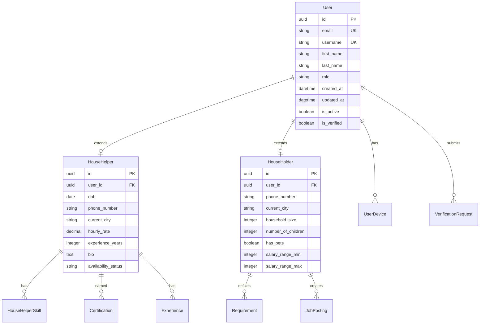
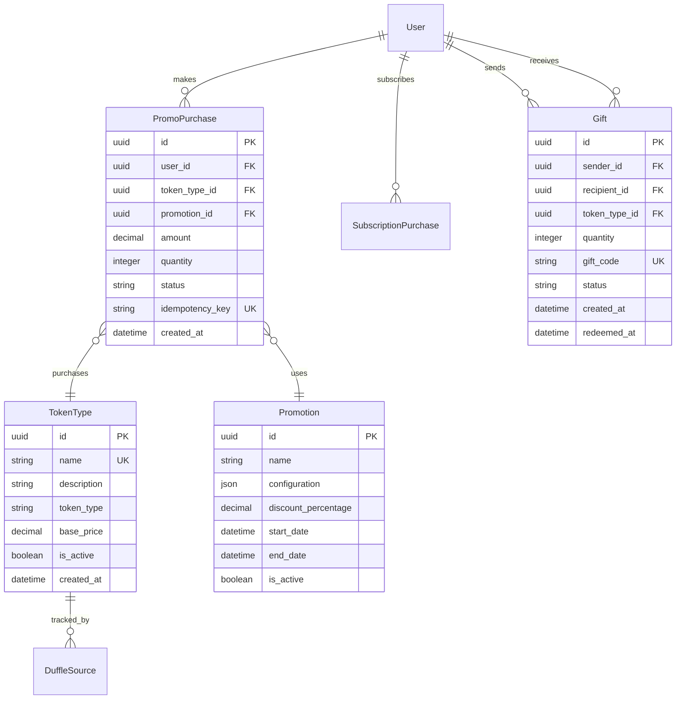
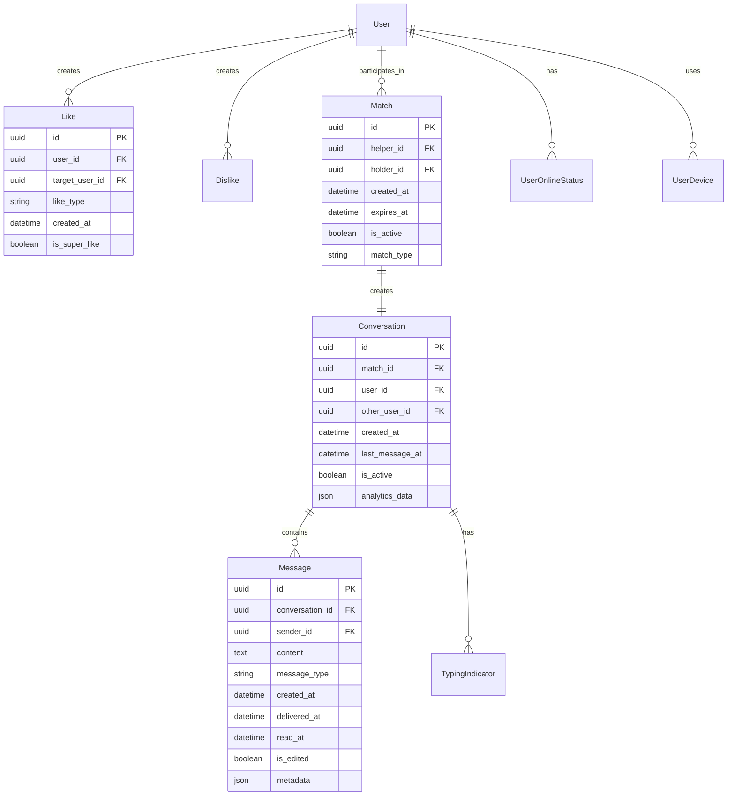

# Database Architecture

The Mdadda platform employs a sophisticated PostgreSQL database architecture designed for scalability, performance, and data integrity in a marketplace environment.

## High-Level Architecture



## Database Configuration

### Primary Database (Main)

```python
# Database configuration
DATABASES = {
    'default': {
        'ENGINE': 'django.db.backends.postgresql',
        'NAME': 'mdadda_main',
        'USER': 'mdadda_user',
        'HOST': 'localhost',
        'PORT': '5432',
        'OPTIONS': {
            'sslmode': 'require',
        },
        'CONN_MAX_AGE': 600,
    }
}
```

**Contains:**
- User management and authentication
- Core marketplace functionality
- Chat and messaging system
- Matching and shortlist algorithms
- Verification and compliance data
- Feed and recommendation system

### Waitlist Database

```python
# Waitlist database configuration
DATABASES['waitlist'] = {
    'ENGINE': 'django.db.backends.postgresql',
    'NAME': 'mdadda_waitlist',
    'USER': 'mdadda_waitlist_user',
    'HOST': 'localhost',
    'PORT': '5432',
    'OPTIONS': {
        'sslmode': 'require',
    },
}
```

**Contains:**
- Pre-launch user registration
- Waitlist management
- Early access tracking
- Marketing analytics

### Database Routing

```python
class WaitlistRouter:
    """
    Route waitlist app to separate database
    """
    def db_for_read(self, model, **hints):
        if model._meta.app_label == 'waitlist':
            return 'waitlist'
        return 'default'

    def db_for_write(self, model, **hints):
        if model._meta.app_label == 'waitlist':
            return 'waitlist'
        return 'default'

    def allow_migrate(self, db, app_label, model_name=None, **hints):
        if app_label == 'waitlist':
            return db == 'waitlist'
        elif db == 'waitlist':
            return False
        return db == 'default'
```

## Entity Relationship Diagram

### Core User System



### Marketplace System



### Matching and Chat System



## Indexing Strategy

### Primary Indexes

```sql
-- User table indexes
CREATE INDEX idx_users_email ON users_user(email);
CREATE INDEX idx_users_username ON users_user(username);
CREATE INDEX idx_users_role ON users_user(role);
CREATE INDEX idx_users_active ON users_user(is_active);
CREATE INDEX idx_users_created ON users_user(created_at);

-- Composite indexes for common queries
CREATE INDEX idx_users_role_active ON users_user(role, is_active);
CREATE INDEX idx_users_active_created ON users_user(is_active, created_at);
```

### Performance Indexes

```sql
-- Marketplace queries
CREATE INDEX idx_promo_user_status ON core_promopurchase(user_id, status);
CREATE INDEX idx_promo_created ON core_promopurchase(created_at);
CREATE INDEX idx_tokens_active ON core_tokentype(is_active);

-- Matching system
CREATE INDEX idx_likes_user_target ON shortlist_like(user_id, target_user_id);
CREATE INDEX idx_matches_helper ON shortlist_match(helper_id, is_active);
CREATE INDEX idx_matches_holder ON shortlist_match(holder_id, is_active);
CREATE INDEX idx_matches_active_created ON shortlist_match(is_active, created_at);

-- Chat system
CREATE INDEX idx_conversations_user ON chats_conversation(user_id);
CREATE INDEX idx_conversations_match ON chats_conversation(match_id);
CREATE INDEX idx_messages_conversation ON chats_message(conversation_id, created_at);
CREATE INDEX idx_messages_sender ON chats_message(sender_id);
```

### Partial Indexes

```sql
-- Only index active records
CREATE INDEX idx_active_users ON users_user(created_at) WHERE is_active = true;
CREATE INDEX idx_active_matches ON shortlist_match(created_at) WHERE is_active = true;
CREATE INDEX idx_pending_verifications ON verification_verificationrequest(created_at)
    WHERE status = 'pending';
```

## Constraints and Data Integrity

### Foreign Key Constraints

```sql
-- User relationships
ALTER TABLE househelps_househelper
    ADD CONSTRAINT fk_househelper_user
    FOREIGN KEY (user_id) REFERENCES users_user(id) ON DELETE CASCADE;

ALTER TABLE households_householder
    ADD CONSTRAINT fk_householder_user
    FOREIGN KEY (user_id) REFERENCES users_user(id) ON DELETE CASCADE;

-- Marketplace constraints
ALTER TABLE core_promopurchase
    ADD CONSTRAINT fk_purchase_user
    FOREIGN KEY (user_id) REFERENCES users_user(id) ON DELETE CASCADE;

ALTER TABLE core_promopurchase
    ADD CONSTRAINT fk_purchase_tokentype
    FOREIGN KEY (token_type_id) REFERENCES core_tokentype(id) ON DELETE PROTECT;
```

### Check Constraints

```sql
-- Business logic constraints
ALTER TABLE core_promopurchase
    ADD CONSTRAINT chk_positive_amount
    CHECK (amount > 0);

ALTER TABLE core_promopurchase
    ADD CONSTRAINT chk_positive_quantity
    CHECK (quantity > 0);

ALTER TABLE househelps_househelper
    ADD CONSTRAINT chk_valid_hourly_rate
    CHECK (hourly_rate >= 0);

ALTER TABLE shortlist_match
    ADD CONSTRAINT chk_different_users
    CHECK (helper_id != holder_id);
```

### Unique Constraints

```sql
-- Prevent duplicate relationships
ALTER TABLE shortlist_like
    ADD CONSTRAINT uk_like_user_target
    UNIQUE (user_id, target_user_id);

ALTER TABLE shortlist_match
    ADD CONSTRAINT uk_match_helper_holder
    UNIQUE (helper_id, holder_id);

-- Business rules
ALTER TABLE core_promopurchase
    ADD CONSTRAINT uk_idempotency_key
    UNIQUE (idempotency_key);

ALTER TABLE core_gift
    ADD CONSTRAINT uk_gift_code
    UNIQUE (gift_code);
```

## Query Performance Patterns

### Optimized User Queries

```sql
-- Get user with profile (uses select_related)
SELECT u.*, hh.*, hd.*
FROM users_user u
LEFT JOIN househelps_househelper hh ON u.id = hh.user_id
LEFT JOIN households_householder hd ON u.id = hd.user_id
WHERE u.id = %s;

-- Get user skills (uses prefetch_related)
SELECT u.id, u.first_name, s.skill_name
FROM users_user u
JOIN househelps_househelper hh ON u.id = hh.user_id
JOIN househelps_househelper_skills hhs ON hh.id = hhs.househelper_id
JOIN core_skill s ON hhs.skill_id = s.id
WHERE u.id = %s;
```

### Marketplace Analytics

```sql
-- Token usage by user segment
SELECT
    u.role,
    tt.name as token_type,
    COUNT(p.id) as purchases,
    SUM(p.amount) as revenue,
    AVG(p.amount) as avg_purchase
FROM core_promopurchase p
JOIN users_user u ON p.user_id = u.id
JOIN core_tokentype tt ON p.token_type_id = tt.id
WHERE p.created_at >= CURRENT_DATE - INTERVAL '30 days'
GROUP BY u.role, tt.name
ORDER BY revenue DESC;
```

### Matching Performance

```sql
-- Find potential matches with filters
WITH helper_stats AS (
    SELECT
        hh.id,
        hh.user_id,
        COUNT(DISTINCT m.id) as total_matches,
        AVG(rating.score) as avg_rating
    FROM househelps_househelper hh
    LEFT JOIN shortlist_match m ON hh.user_id = m.helper_id
    LEFT JOIN reviews_rating rating ON hh.user_id = rating.helper_id
    WHERE hh.availability_status = 'available'
    GROUP BY hh.id, hh.user_id
)
SELECT
    u.id,
    u.first_name,
    u.last_name,
    hh.hourly_rate,
    hs.total_matches,
    hs.avg_rating
FROM users_user u
JOIN househelps_househelper hh ON u.id = hh.user_id
JOIN helper_stats hs ON hh.id = hs.id
WHERE u.is_active = true
    AND hh.current_city = %s
    AND hh.hourly_rate BETWEEN %s AND %s
ORDER BY hs.avg_rating DESC, hs.total_matches ASC
LIMIT 20;
```

## Data Partitioning Strategy

### Time-based Partitioning

```sql
-- Partition large tables by date
CREATE TABLE chats_message_y2024m01 PARTITION OF chats_message
    FOR VALUES FROM ('2024-01-01') TO ('2024-02-01');

CREATE TABLE chats_message_y2024m02 PARTITION OF chats_message
    FOR VALUES FROM ('2024-02-01') TO ('2024-03-01');

-- Automatic partition management
CREATE OR REPLACE FUNCTION create_monthly_partition(table_name TEXT, start_date DATE)
RETURNS VOID AS $$
DECLARE
    partition_name TEXT;
    end_date DATE;
BEGIN
    partition_name := table_name || '_y' || EXTRACT(YEAR FROM start_date) || 'm' ||
                     LPAD(EXTRACT(MONTH FROM start_date)::TEXT, 2, '0');
    end_date := start_date + INTERVAL '1 month';

    EXECUTE format('CREATE TABLE %I PARTITION OF %I FOR VALUES FROM (%L) TO (%L)',
                   partition_name, table_name, start_date, end_date);
END;
$$ LANGUAGE plpgsql;
```

## Backup and Recovery

### Backup Strategy

```bash
#!/bin/bash
# Daily backup script

# Full database backup
pg_dump -h localhost -U mdadda_user -d mdadda_main \
    --format=custom --compress=9 \
    --file="/backups/mdadda_main_$(date +%Y%m%d_%H%M%S).backup"

# Schema-only backup for structure
pg_dump -h localhost -U mdadda_user -d mdadda_main \
    --schema-only --format=plain \
    --file="/backups/mdadda_schema_$(date +%Y%m%d).sql"

# Data-only backup for large tables
pg_dump -h localhost -U mdadda_user -d mdadda_main \
    --data-only --table=chats_message \
    --format=custom --compress=9 \
    --file="/backups/messages_$(date +%Y%m%d).backup"
```

### Point-in-Time Recovery

```bash
# Enable WAL archiving
archive_mode = on
archive_command = 'cp %p /backup/wal/%f'
wal_level = replica

# Recovery configuration
restore_command = 'cp /backup/wal/%f %p'
recovery_target_time = '2024-01-15 14:30:00'
```

## Monitoring and Maintenance

### Performance Monitoring

```sql
-- Long-running queries
SELECT
    pid,
    now() - pg_stat_activity.query_start AS duration,
    query
FROM pg_stat_activity
WHERE (now() - pg_stat_activity.query_start) > interval '5 minutes';

-- Index usage statistics
SELECT
    schemaname,
    tablename,
    attname,
    n_distinct,
    correlation
FROM pg_stats
WHERE schemaname = 'public'
ORDER BY n_distinct DESC;

-- Table sizes
SELECT
    tablename,
    pg_size_pretty(pg_total_relation_size(tablename::regclass)) as size
FROM pg_tables
WHERE schemaname = 'public'
ORDER BY pg_total_relation_size(tablename::regclass) DESC;
```

### Maintenance Tasks

```sql
-- Regular maintenance
ANALYZE; -- Update table statistics
VACUUM ANALYZE; -- Reclaim space and update stats
REINDEX DATABASE mdadda_main; -- Rebuild indexes monthly

-- Automated cleanup
DELETE FROM chats_message
WHERE created_at < NOW() - INTERVAL '2 years'
    AND conversation_id IN (
        SELECT id FROM chats_conversation
        WHERE is_active = false
    );
```

## Security Considerations

### Row Level Security

```sql
-- Enable RLS for sensitive tables
ALTER TABLE users_user ENABLE ROW LEVEL SECURITY;

-- Policy for users to see only their own data
CREATE POLICY user_own_data ON users_user
    USING (id = current_setting('app.current_user_id')::uuid);

-- Policy for admins to see all data
CREATE POLICY admin_all_data ON users_user
    USING (current_setting('app.user_role') = 'admin');
```

### Data Encryption

```python
# Sensitive field encryption
from django_cryptography.fields import encrypt

class User(models.Model):
    email = models.EmailField()
    phone_number = encrypt(models.CharField(max_length=20))
    social_security = encrypt(models.CharField(max_length=20, null=True))

    class Meta:
        db_table = 'users_user'
```

## Next Steps

<CardGroup cols={2}>
  <Card title="User Models" href="/database-schemas/users" icon="user">
    Detailed user and authentication schema documentation
  </Card>
  <Card title="Core Models" href="/database-schemas/core" icon="database">
    Marketplace and business logic models
  </Card>
  <Card title="Chat Models" href="/database-schemas/chats" icon="message">
    Real-time messaging and conversation schemas
  </Card>
  <Card title="Relationships" href="/database-schemas/relationships" icon="share-nodes">
    Complete relationship mapping and dependencies
  </Card>
</CardGroup>