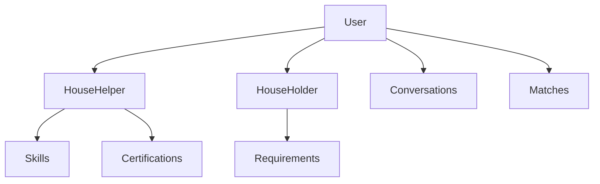
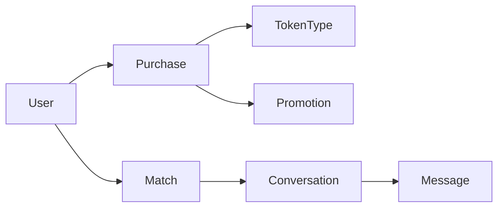

# Database Schemas Overview

The Mdadda platform uses a comprehensive PostgreSQL database architecture designed to support a full-featured house helper marketplace in Kenya. This documentation provides detailed schema information for data engineers and developers working with the platform's data layer.

## Database Architecture

<Card title="Dual Database Setup" icon="server">
  The platform uses two separate PostgreSQL databases:
  - **Main Database**: Core application data and business logic
  - **Waitlist Database**: Pre-launch user registration and waitlist management
</Card>

### Key Characteristics

- **Database Engine**: PostgreSQL with advanced features
- **Primary Keys**: UUID-based for all models (except some legacy tables)
- **Relationships**: Comprehensive foreign key constraints with proper cascade handling
- **Indexing**: Optimized indexes for performance-critical queries
- **Data Routing**: Automatic routing via `waitlist.routers.WaitlistRouter`

## Database Structure Overview

### Core Applications

| Application | Purpose | Key Models |
|-------------|---------|------------|
| **users** | Custom user management | User, Profile extensions |
| **core** | Central marketplace logic | TokenType, Promotion, Skills |
| **households** | House holder profiles | HouseHolder, Requirements |
| **househelps** | House helper profiles | HouseHelper, Certifications |
| **chats** | Real-time messaging | Conversation, Message, OnlineStatus |
| **shortlist** | Matching algorithms | Like, Dislike, Match |
| **verification** | Identity verification | VerificationRequest, Documents |
| **feeds** | User feeds & recommendations | Feed, FeedItem |
| **waitlist** | Pre-launch registration | WaitlistUser |

### Model Naming Conventions

```sql
-- Table naming pattern
{app_name}_{model_name}

-- Examples
users_user
core_tokentype
househelps_househelper
households_householder
chats_conversation
```

## Data Relationships

### User Hierarchy



### Marketplace Flow



## Schema Documentation Structure

This documentation is organized by application modules:

<CardGroup cols={2}>
  <Card title="Core Models" href="/database-schemas/users" icon="users">
    User management, authentication, and profile models
  </Card>
  <Card title="Marketplace" href="/database-schemas/marketplace" icon="store">
    Token system, promotions, and marketplace transactions
  </Card>
  <Card title="Matching System" href="/database-schemas/shortlist" icon="heart">
    Like/dislike system and matching algorithms
  </Card>
  <Card title="Real-time Chat" href="/database-schemas/chats" icon="message">
    Messaging, conversations, and presence tracking
  </Card>
</CardGroup>

## Data Engineering Guidelines

### Performance Considerations

1. **Indexing Strategy**
   - All foreign keys are indexed
   - Compound indexes for common query patterns
   - Partial indexes for filtered queries

2. **Query Optimization**
   - Use `select_related()` for foreign key relationships
   - Use `prefetch_related()` for many-to-many relationships
   - Implement database-level constraints

3. **Data Integrity**
   - Foreign key constraints with appropriate CASCADE rules
   - Check constraints for data validation
   - Unique constraints for business rules

### Migration Best Practices

```python
# Example migration pattern
class Migration(migrations.Migration):
    dependencies = [
        ('app_name', 'previous_migration'),
    ]

    operations = [
        migrations.CreateModel(
            name='ModelName',
            fields=[
                ('id', models.UUIDField(primary_key=True, default=uuid.uuid4)),
                ('created_at', models.DateTimeField(auto_now_add=True)),
                ('updated_at', models.DateTimeField(auto_now=True)),
                # Additional fields...
            ],
            options={
                'db_table': 'app_model',
                'ordering': ['-created_at'],
            },
        ),
    ]
```

## Common Query Patterns

### User Profile Queries

```sql
-- Get complete user profile with relationships
SELECT u.*, hh.*, skills.*
FROM users_user u
LEFT JOIN househelps_househelper hh ON u.id = hh.user_id
LEFT JOIN househelps_househelper_skills hhs ON hh.id = hhs.househelper_id
LEFT JOIN core_skill skills ON hhs.skill_id = skills.id
WHERE u.id = %s;
```

### Marketplace Analytics

```sql
-- Token usage statistics
SELECT
    tt.name as token_type,
    COUNT(p.id) as total_purchases,
    SUM(p.amount) as total_revenue
FROM core_tokentype tt
LEFT JOIN core_promopurchase p ON tt.id = p.token_type_id
WHERE p.created_at >= %s
GROUP BY tt.id, tt.name
ORDER BY total_revenue DESC;
```

### Matching Performance

```sql
-- Active matches with conversation status
SELECT
    m.*,
    c.id as conversation_id,
    COUNT(msg.id) as message_count
FROM shortlist_match m
LEFT JOIN chats_conversation c ON m.id = c.match_id
LEFT JOIN chats_message msg ON c.id = msg.conversation_id
WHERE m.is_active = true
GROUP BY m.id, c.id
ORDER BY m.created_at DESC;
```

## Data Privacy & Security

### PII Data Handling

- **Encrypted Fields**: Sensitive data uses Django's encryption
- **Data Retention**: Automated cleanup of expired data
- **Access Control**: Row-level security for user data
- **GDPR Compliance**: User data deletion workflows

### Backup Strategy

- **Daily Backups**: Automated PostgreSQL dumps
- **Point-in-time Recovery**: WAL-based recovery
- **Cross-region Replication**: Disaster recovery setup
- **Data Validation**: Backup integrity checks

## Monitoring & Analytics

### Key Metrics to Track

1. **User Growth**
   - Daily/monthly active users
   - Registration conversion rates
   - Profile completion rates

2. **Marketplace Activity**
   - Token purchase volume
   - Match success rates
   - Conversation engagement

3. **System Performance**
   - Query response times
   - Database connection usage
   - Index efficiency

### Sample Analytics Queries

```sql
-- Daily user registration trends
SELECT
    DATE(created_at) as registration_date,
    role,
    COUNT(*) as new_users
FROM users_user
WHERE created_at >= CURRENT_DATE - INTERVAL '30 days'
GROUP BY DATE(created_at), role
ORDER BY registration_date DESC;

-- Marketplace conversion funnel
SELECT
    COUNT(DISTINCT u.id) as total_users,
    COUNT(DISTINCT p.user_id) as purchasing_users,
    COUNT(DISTINCT m.helper_id) as matched_helpers,
    COUNT(DISTINCT c.user_id) as chatting_users
FROM users_user u
LEFT JOIN core_promopurchase p ON u.id = p.user_id
LEFT JOIN shortlist_match m ON u.id = m.helper_id OR u.id = m.holder_id
LEFT JOIN chats_conversation c ON u.id = c.user_id OR u.id = c.other_user_id
WHERE u.created_at >= CURRENT_DATE - INTERVAL '30 days';
```

## Next Steps

<CardGroup cols={2}>
  <Card title="Database Architecture" href="/database-schemas/architecture" icon="sitemap">
    Detailed architecture and relationship diagrams
  </Card>
  <Card title="User Models" href="/database-schemas/users" icon="user">
    User, authentication, and profile schemas
  </Card>
  <Card title="Core Models" href="/database-schemas/core" icon="database">
    Central marketplace and business logic models
  </Card>
  <Card title="Application Models" href="/database-schemas/househelps" icon="broom">
    House helper and household specific schemas
  </Card>
</CardGroup>