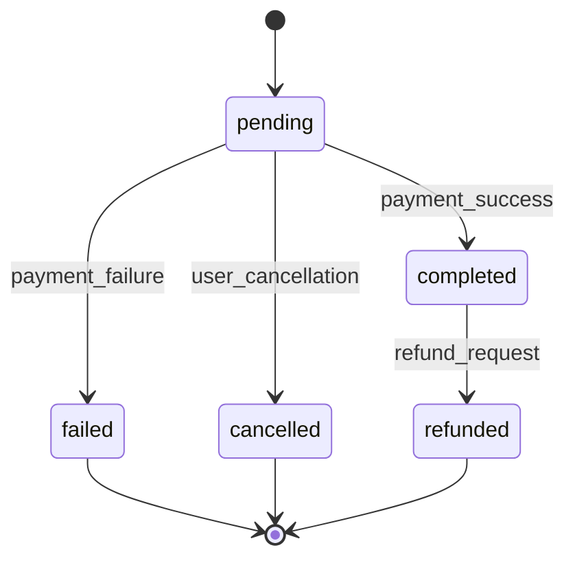

# Marketplace Models Schema

The marketplace system in Mdadda handles token-based transactions, promotional packages, gifts, and subscription management. This system enables monetization while providing value to both house helpers and house holders.

## Token System Architecture

### Token Type Model (`core_tokentype`)

Central model defining available token types and their pricing structure.

```sql
CREATE TABLE core_tokentype (
    id UUID PRIMARY KEY DEFAULT gen_random_uuid(),
    name VARCHAR(100) UNIQUE NOT NULL,
    description TEXT NOT NULL,
    token_type VARCHAR(50) NOT NULL
        CHECK (token_type IN ('like', 'boost', 'incognito', 'super_like', 'premium')),
    base_price DECIMAL(10,2) NOT NULL CHECK (base_price >= 0),
    is_active BOOLEAN DEFAULT TRUE,

    -- Metadata
    created_at TIMESTAMP WITH TIME ZONE DEFAULT CURRENT_TIMESTAMP,
    updated_at TIMESTAMP WITH TIME ZONE DEFAULT CURRENT_TIMESTAMP
);
```

### Model Fields Documentation

| Field | Type | Description | Constraints |
|-------|------|-------------|-------------|
| `id` | UUID | Primary key | Auto-generated UUID |
| `name` | VARCHAR(100) | Display name for token type | Unique, NOT NULL |
| `description` | TEXT | Detailed description of token usage | NOT NULL |
| `token_type` | VARCHAR(50) | Token category | CHECK constraint for valid types |
| `base_price` | DECIMAL(10,2) | Base price in local currency (KES) | >= 0 |
| `is_active` | BOOLEAN | Whether token type is available for purchase | Default TRUE |

### Token Type Examples

```sql
-- Sample token types
INSERT INTO core_tokentype (name, description, token_type, base_price) VALUES
('Basic Like', 'Standard like to show interest in a profile', 'like', 10.00),
('Super Like', 'Premium like that stands out and notifies the recipient', 'super_like', 50.00),
('Profile Boost', 'Increase profile visibility for 24 hours', 'boost', 100.00),
('Incognito Mode', 'Browse profiles privately without appearing in their views', 'incognito', 200.00),
('Premium Access', 'Full platform access with unlimited features', 'premium', 500.00);
```

## Promotional System

### Promotion Model (`core_promotion`)

Defines promotional campaigns and discount structures.

```sql
CREATE TABLE core_promotion (
    id UUID PRIMARY KEY DEFAULT gen_random_uuid(),
    name VARCHAR(200) NOT NULL,
    description TEXT,
    promotion_type VARCHAR(50) NOT NULL
        CHECK (promotion_type IN ('percentage', 'fixed_amount', 'bundle', 'bonus')),

    -- Discount configuration
    discount_percentage DECIMAL(5,2) CHECK (discount_percentage BETWEEN 0 AND 100),
    fixed_discount_amount DECIMAL(10,2) CHECK (fixed_discount_amount >= 0),

    -- Bundle configuration (JSON for complex packages)
    configuration JSONB,

    -- Validity period
    start_date TIMESTAMP WITH TIME ZONE NOT NULL,
    end_date TIMESTAMP WITH TIME ZONE NOT NULL,

    -- Usage limits
    max_uses INTEGER,
    max_uses_per_user INTEGER DEFAULT 1,
    current_uses INTEGER DEFAULT 0,

    -- Status
    is_active BOOLEAN DEFAULT TRUE,
    is_featured BOOLEAN DEFAULT FALSE,

    -- Metadata
    created_at TIMESTAMP WITH TIME ZONE DEFAULT CURRENT_TIMESTAMP,
    updated_at TIMESTAMP WITH TIME ZONE DEFAULT CURRENT_TIMESTAMP,

    -- Constraints
    CHECK (start_date < end_date),
    CHECK (
        (promotion_type = 'percentage' AND discount_percentage IS NOT NULL) OR
        (promotion_type = 'fixed_amount' AND fixed_discount_amount IS NOT NULL) OR
        (promotion_type IN ('bundle', 'bonus') AND configuration IS NOT NULL)
    )
);
```

### Promotion Configuration Examples

```json
-- Bundle promotion configuration
{
  "bundle_type": "starter_pack",
  "items": [
    {"token_type": "like", "quantity": 10},
    {"token_type": "boost", "quantity": 2},
    {"token_type": "super_like", "quantity": 1}
  ],
  "bundle_price": 200.00,
  "savings_amount": 80.00
}

-- Bonus promotion configuration
{
  "bonus_type": "buy_x_get_y",
  "trigger": {"token_type": "like", "quantity": 5},
  "bonus": {"token_type": "super_like", "quantity": 1},
  "description": "Buy 5 likes, get 1 super like free"
}
```

## Purchase Transactions

### Promo Purchase Model (`core_promopurchase`)

Records all token purchases and transactions.

```sql
CREATE TABLE core_promopurchase (
    id UUID PRIMARY KEY DEFAULT gen_random_uuid(),
    user_id UUID NOT NULL REFERENCES users_user(id) ON DELETE CASCADE,
    token_type_id UUID NOT NULL REFERENCES core_tokentype(id) ON DELETE PROTECT,
    promotion_id UUID REFERENCES core_promotion(id) ON DELETE SET NULL,

    -- Transaction details
    quantity INTEGER NOT NULL CHECK (quantity > 0),
    unit_price DECIMAL(10,2) NOT NULL CHECK (unit_price >= 0),
    total_amount DECIMAL(10,2) NOT NULL CHECK (total_amount >= 0),
    discount_amount DECIMAL(10,2) DEFAULT 0 CHECK (discount_amount >= 0),
    final_amount DECIMAL(10,2) NOT NULL CHECK (final_amount >= 0),

    -- Payment information
    payment_method VARCHAR(50),
    payment_reference VARCHAR(200),
    payment_status VARCHAR(20) DEFAULT 'pending'
        CHECK (payment_status IN ('pending', 'completed', 'failed', 'refunded')),

    -- Transaction tracking
    idempotency_key VARCHAR(255) UNIQUE NOT NULL,
    external_transaction_id VARCHAR(255),

    -- Status tracking
    status VARCHAR(20) DEFAULT 'pending'
        CHECK (status IN ('pending', 'completed', 'failed', 'cancelled', 'refunded')),
    processing_notes TEXT,

    -- Timestamps
    created_at TIMESTAMP WITH TIME ZONE DEFAULT CURRENT_TIMESTAMP,
    completed_at TIMESTAMP WITH TIME ZONE,
    updated_at TIMESTAMP WITH TIME ZONE DEFAULT CURRENT_TIMESTAMP
);
```

### Purchase Workflow States



## Subscription System

### Subscription Purchase Model (`core_subscriptionpurchase`)

Manages recurring subscription transactions.

```sql
CREATE TABLE core_subscriptionpurchase (
    id UUID PRIMARY KEY DEFAULT gen_random_uuid(),
    user_id UUID NOT NULL REFERENCES users_user(id) ON DELETE CASCADE,

    -- Subscription details
    subscription_type VARCHAR(50) NOT NULL
        CHECK (subscription_type IN ('monthly', 'quarterly', 'annual')),
    plan_name VARCHAR(100) NOT NULL,

    -- Pricing
    monthly_price DECIMAL(10,2) NOT NULL CHECK (monthly_price >= 0),
    total_amount DECIMAL(10,2) NOT NULL CHECK (total_amount >= 0),

    -- Billing cycle
    billing_cycle_months INTEGER NOT NULL CHECK (billing_cycle_months > 0),
    start_date TIMESTAMP WITH TIME ZONE NOT NULL,
    end_date TIMESTAMP WITH TIME ZONE NOT NULL,
    next_billing_date TIMESTAMP WITH TIME ZONE,

    -- Payment tracking
    payment_method VARCHAR(50),
    external_subscription_id VARCHAR(255),

    -- Status
    status VARCHAR(20) DEFAULT 'active'
        CHECK (status IN ('active', 'cancelled', 'suspended', 'expired')),
    auto_renew BOOLEAN DEFAULT TRUE,

    -- Cancellation tracking
    cancelled_at TIMESTAMP WITH TIME ZONE,
    cancellation_reason TEXT,

    -- Metadata
    created_at TIMESTAMP WITH TIME ZONE DEFAULT CURRENT_TIMESTAMP,
    updated_at TIMESTAMP WITH TIME ZONE DEFAULT CURRENT_TIMESTAMP,

    CHECK (start_date < end_date)
);
```

## Gift System

### Gift Model (`core_gift`)

Peer-to-peer token gifting system.

```sql
CREATE TABLE core_gift (
    id UUID PRIMARY KEY DEFAULT gen_random_uuid(),
    sender_id UUID NOT NULL REFERENCES users_user(id) ON DELETE CASCADE,
    recipient_id UUID REFERENCES users_user(id) ON DELETE SET NULL,
    token_type_id UUID NOT NULL REFERENCES core_tokentype(id) ON DELETE PROTECT,

    -- Gift details
    quantity INTEGER NOT NULL CHECK (quantity > 0),
    total_value DECIMAL(10,2) NOT NULL CHECK (total_value >= 0),
    gift_message TEXT,

    -- Gift delivery
    gift_code VARCHAR(20) UNIQUE NOT NULL,
    recipient_email VARCHAR(254),
    recipient_phone VARCHAR(20),

    -- Status tracking
    status VARCHAR(20) DEFAULT 'pending'
        CHECK (status IN ('pending', 'sent', 'redeemed', 'expired', 'cancelled')),

    -- Timestamps
    created_at TIMESTAMP WITH TIME ZONE DEFAULT CURRENT_TIMESTAMP,
    sent_at TIMESTAMP WITH TIME ZONE,
    redeemed_at TIMESTAMP WITH TIME ZONE,
    expires_at TIMESTAMP WITH TIME ZONE,

    -- Constraints
    CHECK (sender_id != recipient_id),
    CHECK (
        (recipient_id IS NOT NULL) OR
        (recipient_email IS NOT NULL OR recipient_phone IS NOT NULL)
    )
);
```

### Gift Code Generation

```sql
-- Function to generate unique gift codes
CREATE OR REPLACE FUNCTION generate_gift_code()
RETURNS VARCHAR(20) AS $$
DECLARE
    code VARCHAR(20);
    exists_check INTEGER;
BEGIN
    LOOP
        code := 'MDADA' || LPAD(floor(random() * 1000000)::text, 6, '0') ||
                UPPER(substring(md5(random()::text) from 1 for 4));

        SELECT COUNT(*) INTO exists_check
        FROM core_gift
        WHERE gift_code = code;

        EXIT WHEN exists_check = 0;
    END LOOP;

    RETURN code;
END;
$$ LANGUAGE plpgsql;

-- Set default value for gift_code
ALTER TABLE core_gift
ALTER COLUMN gift_code SET DEFAULT generate_gift_code();
```

## Analytics and Tracking

### DuffleSource Model (`core_dufflesource`)

Attribution tracking for token purchases and user acquisition.

```sql
CREATE TABLE core_dufflesource (
    id UUID PRIMARY KEY DEFAULT gen_random_uuid(),
    user_id UUID NOT NULL REFERENCES users_user(id) ON DELETE CASCADE,
    token_type_id UUID NOT NULL REFERENCES core_tokentype(id) ON DELETE CASCADE,

    -- Attribution data
    source_type VARCHAR(50) NOT NULL
        CHECK (source_type IN ('organic', 'referral', 'social', 'paid_ads', 'email', 'sms')),
    source_name VARCHAR(100),
    campaign_name VARCHAR(100),
    medium VARCHAR(50),
    content VARCHAR(100),

    -- UTM parameters
    utm_source VARCHAR(100),
    utm_medium VARCHAR(100),
    utm_campaign VARCHAR(100),
    utm_term VARCHAR(100),
    utm_content VARCHAR(100),

    -- Conversion tracking
    conversion_type VARCHAR(50) NOT NULL
        CHECK (conversion_type IN ('purchase', 'registration', 'engagement')),
    conversion_value DECIMAL(10,2),

    -- Device and location
    device_type VARCHAR(20),
    ip_address INET,
    country_code VARCHAR(2),
    city VARCHAR(100),

    -- Metadata
    created_at TIMESTAMP WITH TIME ZONE DEFAULT CURRENT_TIMESTAMP,
    session_id VARCHAR(100),
    user_agent TEXT
);
```

## Business Intelligence Queries

### Revenue Analytics

```sql
-- Monthly revenue by token type
SELECT
    DATE_TRUNC('month', p.created_at) as month,
    tt.name as token_type,
    COUNT(p.id) as total_purchases,
    SUM(p.quantity) as tokens_sold,
    SUM(p.final_amount) as total_revenue,
    AVG(p.final_amount) as avg_purchase_value
FROM core_promopurchase p
JOIN core_tokentype tt ON p.token_type_id = tt.id
WHERE p.status = 'completed'
    AND p.created_at >= CURRENT_DATE - INTERVAL '12 months'
GROUP BY DATE_TRUNC('month', p.created_at), tt.id, tt.name
ORDER BY month DESC, total_revenue DESC;

-- User purchasing behavior
SELECT
    u.role,
    COUNT(DISTINCT p.user_id) as unique_purchasers,
    COUNT(p.id) as total_purchases,
    SUM(p.final_amount) as total_spent,
    AVG(p.final_amount) as avg_purchase,
    SUM(p.quantity) as total_tokens
FROM core_promopurchase p
JOIN users_user u ON p.user_id = u.id
WHERE p.status = 'completed'
    AND p.created_at >= CURRENT_DATE - INTERVAL '30 days'
GROUP BY u.role
ORDER BY total_spent DESC;
```

### Promotion Effectiveness

```sql
-- Promotion performance analysis
SELECT
    pr.name as promotion_name,
    pr.promotion_type,
    COUNT(p.id) as total_uses,
    SUM(p.quantity) as tokens_sold,
    SUM(p.total_amount - p.final_amount) as total_discount_given,
    SUM(p.final_amount) as revenue_after_discount,
    AVG(p.final_amount) as avg_purchase_value
FROM core_promotion pr
LEFT JOIN core_promopurchase p ON pr.id = p.promotion_id
WHERE pr.is_active = true
    AND p.status = 'completed'
GROUP BY pr.id, pr.name, pr.promotion_type
ORDER BY total_uses DESC;

-- Gift system analytics
SELECT
    DATE_TRUNC('week', g.created_at) as week,
    COUNT(g.id) as gifts_created,
    COUNT(g.id) FILTER (WHERE g.status = 'redeemed') as gifts_redeemed,
    ROUND(
        COUNT(g.id) FILTER (WHERE g.status = 'redeemed')::decimal /
        NULLIF(COUNT(g.id), 0) * 100, 2
    ) as redemption_rate,
    SUM(g.total_value) as total_gift_value
FROM core_gift g
WHERE g.created_at >= CURRENT_DATE - INTERVAL '8 weeks'
GROUP BY DATE_TRUNC('week', g.created_at)
ORDER BY week DESC;
```

## Indexes and Performance

### Primary Indexes

```sql
-- Transaction performance indexes
CREATE INDEX idx_promopurchase_user_status ON core_promopurchase(user_id, status);
CREATE INDEX idx_promopurchase_created ON core_promopurchase(created_at);
CREATE INDEX idx_promopurchase_token_type ON core_promopurchase(token_type_id);
CREATE INDEX idx_promopurchase_idempotency ON core_promopurchase(idempotency_key);

-- Gift system indexes
CREATE INDEX idx_gift_sender ON core_gift(sender_id);
CREATE INDEX idx_gift_recipient ON core_gift(recipient_id);
CREATE INDEX idx_gift_code ON core_gift(gift_code);
CREATE INDEX idx_gift_status_expires ON core_gift(status, expires_at);

-- Promotion indexes
CREATE INDEX idx_promotion_active_dates ON core_promotion(is_active, start_date, end_date);
CREATE INDEX idx_promotion_type ON core_promotion(promotion_type);

-- Analytics indexes
CREATE INDEX idx_dufflesource_user_token ON core_dufflesource(user_id, token_type_id);
CREATE INDEX idx_dufflesource_source ON core_dufflesource(source_type, source_name);
CREATE INDEX idx_dufflesource_created ON core_dufflesource(created_at);
```

### Composite Indexes for Analytics

```sql
-- Revenue analysis
CREATE INDEX idx_purchase_month_token ON core_promopurchase(
    DATE_TRUNC('month', created_at),
    token_type_id,
    status
) WHERE status = 'completed';

-- User behavior analysis
CREATE INDEX idx_purchase_user_created ON core_promopurchase(
    user_id,
    created_at,
    status
) WHERE status = 'completed';
```

## Data Validation and Constraints

### Business Logic Constraints

```sql
-- Ensure gift expiration is in the future
ALTER TABLE core_gift
ADD CONSTRAINT chk_gift_expires_future
CHECK (expires_at > created_at);

-- Validate promotion dates
ALTER TABLE core_promotion
ADD CONSTRAINT chk_promotion_valid_dates
CHECK (start_date < end_date AND end_date > CURRENT_TIMESTAMP);

-- Ensure subscription billing is logical
ALTER TABLE core_subscriptionpurchase
ADD CONSTRAINT chk_subscription_billing
CHECK (next_billing_date >= start_date AND next_billing_date <= end_date);

-- Purchase amount validation
ALTER TABLE core_promopurchase
ADD CONSTRAINT chk_purchase_amounts
CHECK (
    final_amount = total_amount - discount_amount AND
    total_amount = quantity * unit_price
);
```

### Data Integrity Functions

```sql
-- Function to validate promotion usage limits
CREATE OR REPLACE FUNCTION check_promotion_usage()
RETURNS TRIGGER AS $$
BEGIN
    -- Check overall usage limit
    IF (
        SELECT current_uses
        FROM core_promotion
        WHERE id = NEW.promotion_id
    ) >= (
        SELECT max_uses
        FROM core_promotion
        WHERE id = NEW.promotion_id AND max_uses IS NOT NULL
    ) THEN
        RAISE EXCEPTION 'Promotion usage limit exceeded';
    END IF;

    -- Check per-user usage limit
    IF (
        SELECT COUNT(*)
        FROM core_promopurchase
        WHERE promotion_id = NEW.promotion_id
            AND user_id = NEW.user_id
            AND status = 'completed'
    ) >= (
        SELECT max_uses_per_user
        FROM core_promotion
        WHERE id = NEW.promotion_id
    ) THEN
        RAISE EXCEPTION 'User promotion usage limit exceeded';
    END IF;

    RETURN NEW;
END;
$$ LANGUAGE plpgsql;

-- Apply trigger
CREATE TRIGGER trg_check_promotion_usage
    BEFORE INSERT ON core_promopurchase
    FOR EACH ROW
    WHEN (NEW.promotion_id IS NOT NULL)
    EXECUTE FUNCTION check_promotion_usage();
```

## Next Steps

<CardGroup cols={2}>
  <Card title="User Models" href="/database-schemas/users" icon="users">
    User management and authentication schemas
  </Card>
  <Card title="House Helper Models" href="/database-schemas/househelps" icon="broom">
    House helper profiles and service schemas
  </Card>
  <Card title="Household Models" href="/database-schemas/households" icon="house">
    House holder profiles and requirements
  </Card>
  <Card title="Chat Models" href="/database-schemas/chats" icon="message">
    Real-time messaging and conversation schemas
  </Card>
</CardGroup>